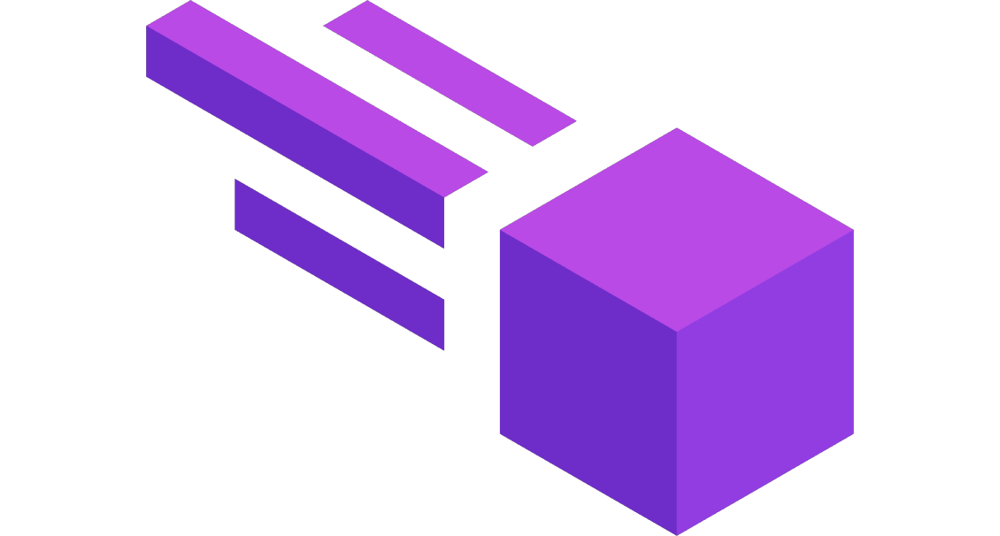

<h1 align="center">Meteor</h1>

A Minecraft Fabric Utility Mod for anarchy servers.

    
    

A fork of [meteor-client](https://github.com/MeteorDevelopment/meteor-client) for Minecraft 26.2 by [EvModder](https://github.com/EvModder). Not an official Meteor release. For usage and documentation, see the [upstream README](https://github.com/MeteorDevelopment/meteor-client#readme). Licensing and attribution are inherited from upstream.

## [↓ Download latest jar](https://github.com/EvModder/Meteor-EvFork/releases/download/latest/meteor-evfork-latest.jar)

## Changes in this fork

- **eBounce:** Updated Grim anticheat workaround for 1.21.4-26.2; no longer pauses with the inventory open.
- **ViaFabricPlus 5:** Adds VFP 5 support; update or remove older VFP versions to avoid startup failures.
- **Portals:** Keeps chat open and preserves unsent messages through nether portals.
- **Iris compatibility:** Fixes tracer and ESP view bobbing with shaders.
- **Rendering stability:** Fixes an entity-outline rendering crash.

Meteor maintainers: Feel free to DM me if you would like anything from here submitted upstream as a PR.
